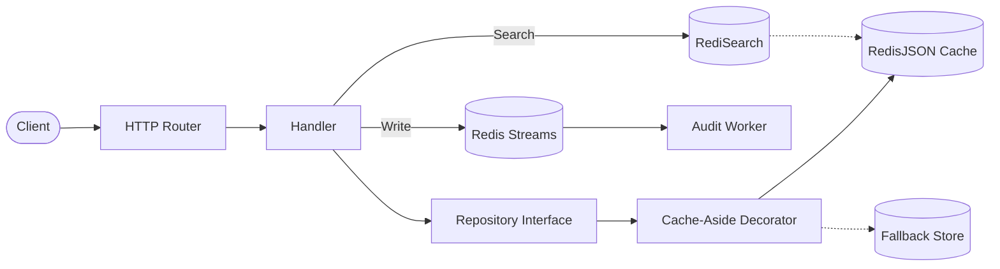
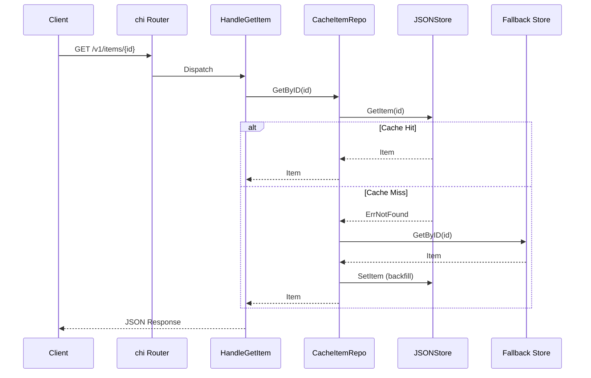
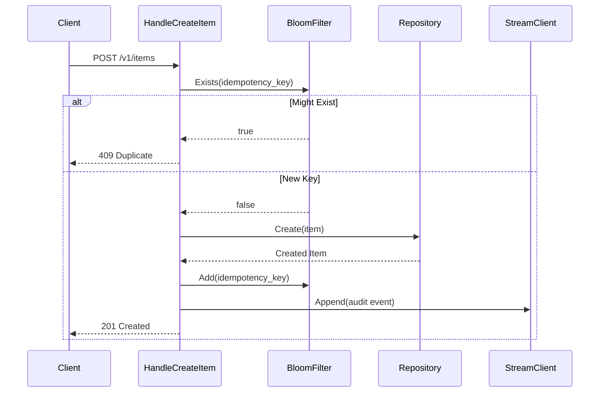
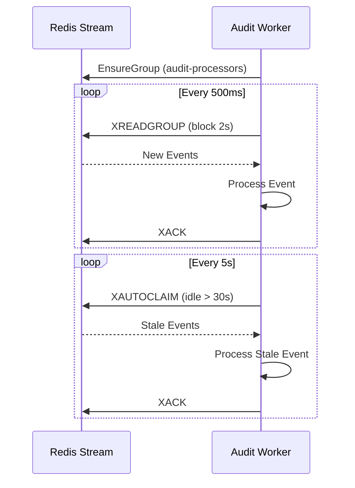

# RedisForge Implementation Architecture

RedisForge is shaped like a small production service. The point is not to create a large domain. The point is to make Redis patterns easy to inspect in realistic backend code.

## System Flow

## Code Map

| Area | Path | Responsibility |
| --- | --- | --- |
| Entrypoint | `cmd/redisforge/main.go` | Calls `app.Run()` and exits on fatal startup errors |
| App wiring | `internal/app/app.go` | Creates config, logger, Redis clients, repositories, workers, router, and shutdown flow |
| Config | `internal/config` | Typed environment config and validation |
| Domain | `internal/domain` | `Item`, audit event, and sentinel errors |
| Handlers | `internal/handlers` | HTTP endpoints and JSON/error helpers |
| Redis wrappers | `internal/redisx` | Small focused wrappers around Redis modules |
| Repositories | `internal/repo` | Item repository interface, memory fallback, cache-aside decorator |
| Workers | `internal/workers` | Redis Streams audit consumer |
| Observability | `internal/observability` | Metrics and tracing hooks |
| Deployments | `deployments` | Redis Stack, Sentinel, Cluster, Prometheus, Grafana |

## Request Lifecycle

Example: `GET /v1/items/{id}`

This is a cache-aside read path. Redis accelerates reads, but the fallback repository remains the source of truth.

## Write Lifecycle

Example: `POST /v1/items`

The Bloom filter is a fast pre-check. If it says a key does not exist, it is definitely new. If it says a key might exist, RedisForge treats it as a duplicate to demonstrate the shape of the idempotency flow.

## Worker Lifecycle

The audit worker demonstrates durable background processing:

Use this as the reference implementation when revising Redis Streams.

## Topology Boundary

`internal/redisx/client.go` returns a `redis.UniversalClient`. That keeps topology concerns in one place:

- Single-node client for local learning.
- Sentinel failover client for high availability.
- Cluster client for horizontal scale.

The rest of the app receives an interface and does not need to know which topology is active.

## Why The Domain Is Small

The project uses Items because a small domain keeps the architecture readable. The important lessons are the Redis patterns:

- cache-aside reads
- write invalidation/update discipline
- JSON document storage
- search index design
- idempotency with probabilistic data structures
- durable async processing
- topology-aware Redis clients
- observability around cache and Redis behavior

