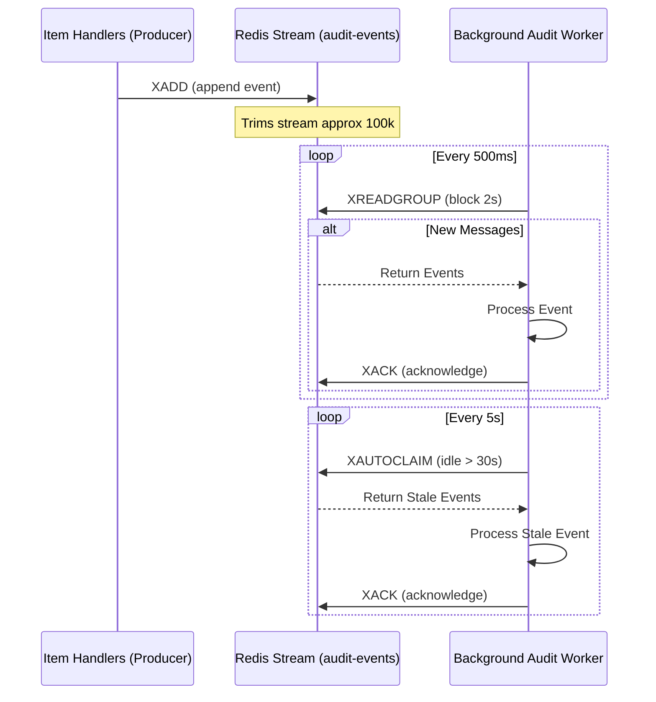
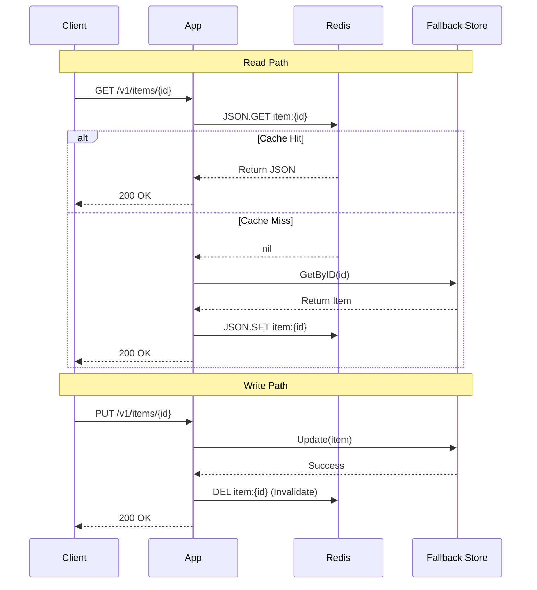

# Redis Patterns In RedisForge

This document is the Redis revision sheet for the project. Each section answers: what the pattern is, where it lives in code, and what to remember.

## RedisJSON

Where: `internal/redisx/json.go`

RedisForge stores each Item as a RedisJSON document:

```text
item:{id} -> JSON document
```

Why it matters:

- Keeps the cached object close to the API shape.
- Enables partial updates like score increments without fetching the full object into Go.
- Works directly with RediSearch `ON JSON` indexing.

Revision note: RedisJSON is useful when the object is naturally document-shaped and you want path-level operations. HASH is simpler when the object is flat and you do not need nested arrays or JSON path indexing.

## RedisBloom

Where: `internal/redisx/bloom.go`

RedisForge uses a Bloom filter for idempotency pre-checks:

```text
BF.EXISTS bf:idempotency request-id
BF.ADD bf:idempotency request-id
```

Why it matters:

- Bloom filters have no false negatives.
- If Redis says "not present," the request key is definitely new.
- If Redis says "might be present," the app should confirm against the source of truth in stricter production systems.

Revision note: Bloom filters trade memory for speed. Lower false-positive rates cost more memory.

## RediSearch

Where: `internal/redisx/search.go`

RedisForge creates an index over JSON documents:

```text
FT.CREATE idx:items ON JSON PREFIX 1 item:{
```

Fields:

| Field | Type | Purpose |
| --- | --- | --- |
| `$.name` | TEXT | Full-text search |
| `$.category` | TAG | Exact category filters |
| `$.tags[*]` | TAG | Multi-tag filtering |
| `$.score` | NUMERIC SORTABLE | Ranges and sorting |

Revision note: TEXT fields are for language-like search. TAG fields are for exact matching. NUMERIC fields are for ranges and sorting.

## Redis Streams

Where: `internal/redisx/streams.go`, `internal/workers/audit_workers.go`

RedisForge uses Streams as a durable audit log:



Why it matters:

- Events survive process restarts.
- Consumer groups let multiple workers share work.
- Pending entries make failed processing visible.
- `XAUTOCLAIM` lets another worker recover stale work.

Revision note: Streams are for durable work. Pub/Sub is for live notifications that can be missed.

## Pub/Sub

Where: `internal/redisx/pubsub.go`

RedisForge includes Pub/Sub to contrast with Streams.

Use Pub/Sub when:

- Subscribers only need live messages.
- Losing a message is acceptable.
- You do not need replay, ACKs, or backpressure.

Use Streams when:

- Work must be processed.
- Messages must survive restarts.
- You need replay or consumer groups.

## Cache-Aside Repository

Where: `internal/repo/item_cache.go`

Pattern:



Why it matters:

- Keeps the fallback store as the source of truth.
- Lets Redis be added without changing handler code.
- Makes cache behavior testable behind the repository interface.

Revision note: cache-aside is simple and common, but stale data is the main risk. Write paths must have clear update or invalidation rules.

## Sentinel

Where: `internal/redisx/client.go`, `deployments/redis-sentinel`

Sentinel solves high availability for a single logical Redis master:

- monitors master and replicas
- promotes a replica when the master fails
- lets the client reconnect to the new master

Revision note: Sentinel does not shard data. It is HA, not horizontal scale.

## Cluster

Where: `internal/redisx/client.go`

Cluster solves horizontal scale by distributing 16,384 hash slots across masters.

Key lesson (Hash-Tags):

When running in Cluster mode, multi-key operations (like a transaction, or a pipeline operating on different keys) will fail if the keys belong to different hash slots on different nodes. 

To solve this, Redis uses **hash tags**. If a key contains a substring enclosed by `{` and `}`, only that substring is hashed to determine the slot.

```text
item:{123}:json  --> hashes "123" --> Slot 12182
item:{123}:audit --> hashes "123" --> Slot 12182
```

Because both keys hash to the same slot, they are guaranteed to live on the same physical master node, making multi-key operations safe.

Revision note: Cluster changes how you think about key design. Multi-key operations need keys in the same hash slot.

